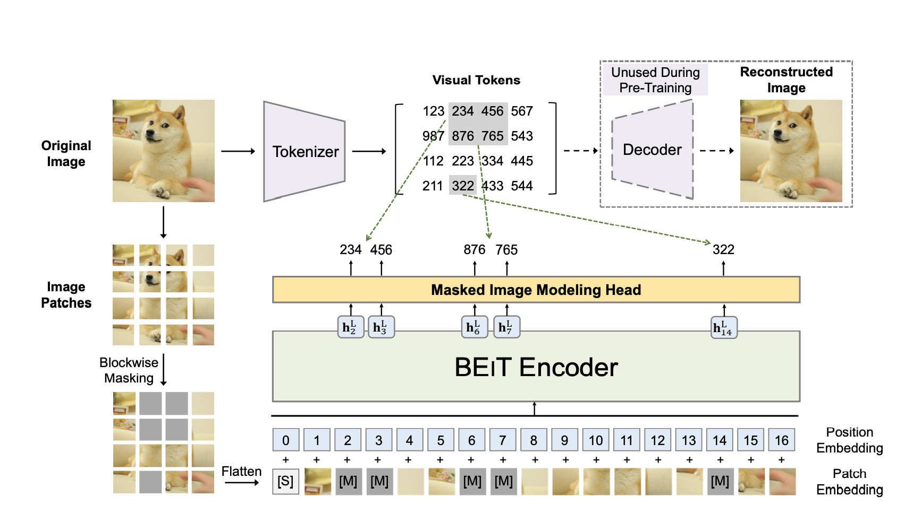
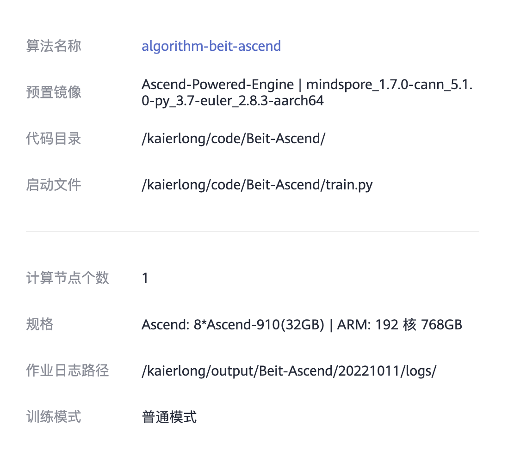
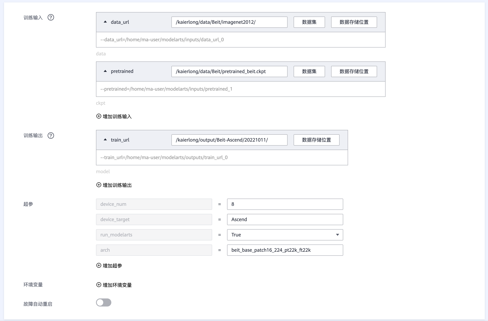
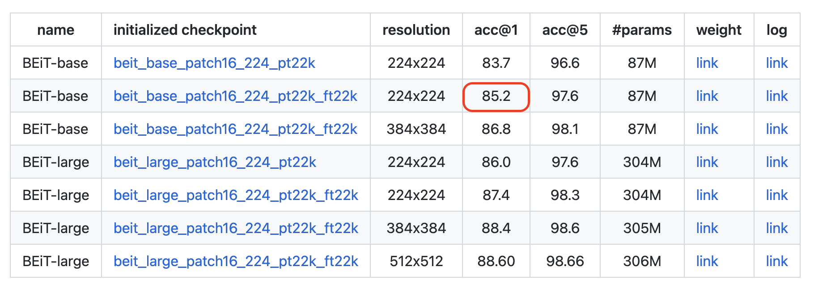
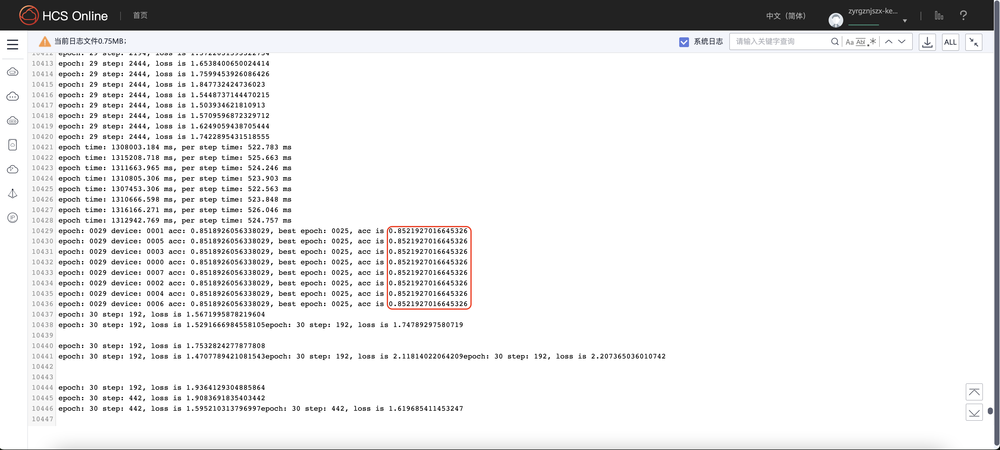

# BEiT 模型自验报告

> 邢朝龙 kaierlong@126.com


## 1. 模型简介

### 1.1 网络模型结构简介

本文提出了一种自监督视觉表示模型BEIT。受BERT的启发，作者提出了一个预训练任务，即 **masked image modeling（MIM）** 。MIM对每个图像使用两个视图，即图像patch和视觉token。作者将图像分割成一个网格的patches，这些patch是主干Transformer的输入表示。此外，作者将图像“tokenize”为离散视觉token，这是通过离散VAE的潜在代码获得的。在预训练期间，作者随机mask部分图像patch，并将损坏的输入到Transformer。该模型学习恢复原始图像的视觉token，而不是mask patch的原始像素。

 


### 1.2 数据集

> 所用数据集地址：
>
> 启智社区：https://git.openi.org.cn/kaierlong/imagenet2012_whole/datasets
>
> 中原算力：obs://kaierlong/data/Beit/imagenet2012

使用训练及测试数据集如下：

```shell
使用的数据集：ImageNet2012

数据集大小：共1000个类、224*224彩色图像
训练集：共1,281,167张图像
测试集：共50,000张图像
数据格式：JPEG
注：数据在dataset.py中处理。
下载数据集，目录结构如下：
└─imagenet
   ├─train                 # 训练数据集
   └─val                   # 评估数据集
```


### 1.3 代码提交地址

暂时提交在启智中，私有未开源。

启智仓库地址如下：https://git.openi.org.cn/kaierlong/Beit-Ascend.git

中原算力：obs://kaierlong/code/Beit-Ascend


## 2. 代码目录结构说明

代码目录结构及说明如下：

```shell
.
├── README.md    // 说明文档
├── README_CN.md    // 中文说明文档
├── image    // 文档图片目录
├── src
│   ├── args.py
│   ├── configs    // 模型参数配置目录
│   │   ├── beit_base_patch16_224_pt22k_ft22k.yaml    // 配置文件
│   │   └── parser.py
│   ├── data    // 数据加载及处理目录
│   │   ├── __init__.py
│   │   ├── augment
│   │   │   ├── __init__.py
│   │   │   ├── auto_augment.py
│   │   │   ├── custom_transforms.py
│   │   │   ├── mixup.py
│   │   │   └── random_erasing.py
│   │   ├── data_utils
│   │   │   ├── __init__.py
│   │   │   └── moxing_adapter.py
│   │   └── imagenet.py
│   ├── models    // 模型定义目录
│   │   ├── __init__.py
│   │   └── beit
│   │       ├── __init__.py
│   │       ├── beit.py    // beit定义文件
│   │       ├── get_beit.py
│   │       └── misc.py
│   ├── tools    // 相关工具目录
│   │   ├── __init__.py
│   │   ├── callback.py
│   │   ├── cell.py
│   │   ├── criterion.py
│   │   ├── get_misc.py
│   │   ├── optimizer.py
│   │   └── schedulers.py
│   └── trainers    // 训练目录
│       ├── __init__.py
│       ├── model_ema.py
│       ├── train_one_step_with_ema.py
│       └── train_one_step_with_scale_and_clip_global_norm.py
├── conv_pth2ckpt.py    // 预训练权重转换
├── eval.py    // 评估文件
└── train.py    // 训练文件
```


## 3. 自验结果（交付精度规格时需要补齐）

### 3.1 自验环境

软硬件环境如下：

- 中原算力：Ascend-Powered-Engine | mindspore_1.7.0-cann_5.1.0-py_3.7-euler_2.8.3-aarch64
- Ascend: 8*Ascend-910(32GB) | ARM: 192 核 768GB


**详细环境配置参见下图：**




### 3.2 训练超参数

超参数配置如下：

```yaml
# Architecture
arch: beit_base_patch16_224_pt22k_ft22k

# ===== Dataset ===== #
data_url: ./data/imagenet
set: ImageNet
num_classes: 1000
mix_up: 0.
cutmix: 0.
auto_augment: rand-m9-mstd0.5-inc1
interpolation: bicubic
re_prob: 0.25
re_mode: pixel
re_count: 1
mixup_prob: 1.0
switch_prob: 0.5
mixup_mode: batch
crop_ratio: 0.875
image_size: 224


# ===== Learning Rate Policy ======== #
optimizer: adamw
lr_scheduler: cosine_lr
base_lr: 0.00002
min_lr: 0.000001
warmup_length: 5
warmup_lr: 0.000001
cool_length: 0
cool_lr: 0.000001
layer_decay: 0.85


# ===== Network training config ===== #
amp_level: O1
keep_bn_fp32: True
beta: [ 0.9, 0.999 ]
is_dynamic_loss_scale: True
use_global_norm: True
clip_global_norm_value: 5.
enable_ema: False
ema_decay: 0.9999
loss_scale: 1024
weight_decay: 0.00000001
momentum: 0.9
label_smoothing: 0.1
epochs: 30
batch_size: 64


# ===== Hardware setup ===== #
num_parallel_workers: 16
device_target: Ascend

# ===== Model config ===== #
drop_path_rate: 0.1
rel_pos_bias: True
abs_pos_emb: False
```


### 3.3 训练

> 说明：
>
> 因为需要用到预训练模型，需要将pytorch模型进行转换。
>
> 提前下载pytorch模型：
>
> - 下载地址：https://conversationhub.blob.core.windows.net/beit-share-public/beit/beit_base_patch16_224_pt22k_ft22k.pth
> - 转换命令：
>
> ```shell
> # 友情提示需要用到pytorch环境
> python3 conv_pth2ckpt.py --pth_file=beit_base_patch16_224_pt22k_ft22k.pth --ckpt_file=pretrained_beit.ckpt
> ```

### 3.3.1 如何启动训练脚本

训练如何启动：

- 中原算力

模型训练在中原算力完成，完整训练配置如下图所示：



- 本地命令

**如果需要本地训练，可以使用如下命令：**

```shell
python3 train.py --run_modelarts=True --arch=beit_base_patch16_224_pt22k_ft22k --pretrained=${pretrained} --device_num=8
```


#### 3.3.2 训练精度结果

- 论文精度如下:



- 复现精度如下：

  > 模型地址（中原算力）：obs://kaierlong/output/Beit-Ascend/20221011/ckpt_best_0000/beit_base_patch16_224_pt22k_ft22k_0000-25_2502.ckpt



- 精度结果对比

  - 论文精度为：85.2
  - 复现精度为：**85.219**（最优值）


### 3.4 模型推理

推理命令如下：

```shell
python3 eval.py --config=src/configs/beit_base_patch16_224_pt22k_ft22k.yaml --pretrained={ckpt_path} --device_id={device_id} --device_target={device_target} --data_url={data_url}
```


## 4. 参考资料

### 4.1 参考论文

- [BEiT: BERT Pre-Training of Image Transformers](https://arxiv.org/abs/2106.08254)


### 4.2 参考git项目

- [microsoft/unilm/beit](https://github.com/microsoft/unilm/tree/master/beit)


### 4.3 参考文献

- [《BEIT》-基于图像重建进行预训练！微软提出BEIT，Top-1准确率达86.3%！代码已开源！](https://zhuanlan.zhihu.com/p/438726362)


